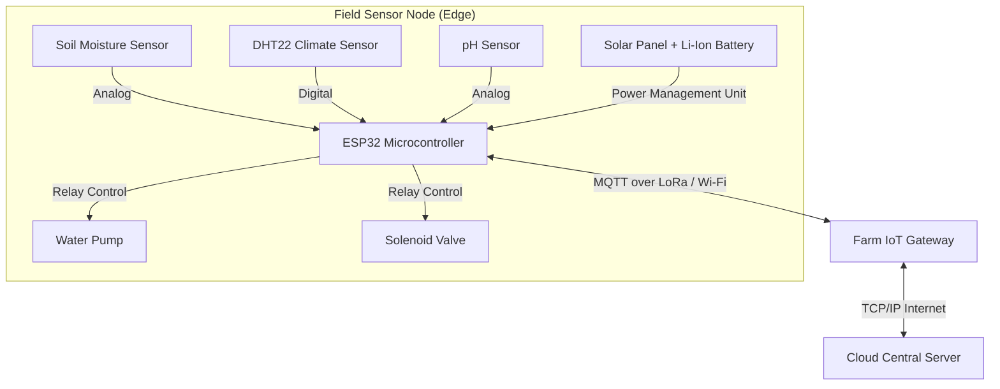
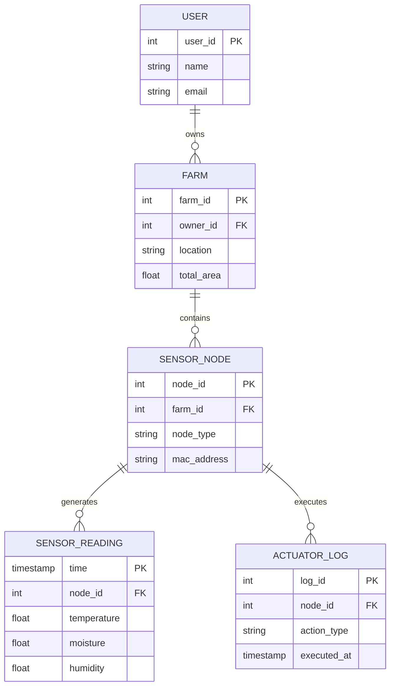

# Scalable Agricultural Monitoring System: Architecture and Implementation Plan

This document serves as a comprehensive system design and plan for a real-world **Scalable Agricultural Monitoring System**, covering embedded hardware architecture, data modeling, scalability, and UI/UX dashboard design.

---

## 1. Physical Architecture of the Embedded System

The physical architecture connects the field-level environmental realities with the digital monitoring infrastructure.

### Sensors and Actuators
*   **Microcontroller:** **ESP32** is selected due to its cost-effectiveness, high processing power, low power consumption modes, and built-in Wi-Fi/Bluetooth capabilities, allowing it to seamlessly act as an edge device.
*   **Sensors (Inputs):**
    *   *Soil Moisture Sensor (Capacitive):* Measures volumetric water content. Interfaces via Analog pins.
    *   *DHT22 (Temperature & Humidity):* Monitors ambient climate. Interfaces via a single-wire digital signal.
    *   *pH Sensor:* Checks soil acidity/alkalinity for optimal crop growth. Interfaces via Analog-to-Digital Converter (ADC).
*   **Actuators (Outputs):**
    *   *Water Pumps & Solenoid Valves:* Controls irrigation. Interfaced through relay modules connected to ESP32 digital output pins to isolate the high-voltage/current pump circuits from the microcontroller.

### Communication Protocols
*   **I2C / SPI:** Used for short-distance, on-board communication (e.g., connecting a local OLED display or precise ADC modules to the ESP32).
*   **MQTT (Message Queuing Telemetry Transport) over Wi-Fi / LoRa:** MQTT is a lightweight publish-subscribe network protocol perfect for IoT. If the farm is small, standard Wi-Fi is sufficient. For massive farmlands, **LoRa (Long Range)** communication is used for node-to-gateway communication due to its long range and extremely low power requirements.

### Power Management
Nodes located in the middle of a farm operate on a **Solar-Powered Li-Ion Battery System**. To ensure efficient operation, the ESP32 utilizes **Deep Sleep Mode**. The microcontroller wakes up every 15 minutes, powers the sensors, reads the data, transmits it via Wi-Fi/LoRa, and immediately returns to deep sleep. This extends battery life to several months or even years.

### Block Diagram

---

## 2. Data Model Design

Data modeling is the process of creating a structured visual representation of a whole information system or parts of it to communicate connections between data points and structures.

### Storage Methods and Justification
This system utilizes a **Polyglot Persistence (Hybrid)** approach:
1.  **Time-Series Database (NoSQL - e.g., InfluxDB):** Specifically designed to handle high volumes of timestamped data. Sensor readings (moisture, temperature) arrive constantly. Time-series databases handle this high write speed efficiently and make querying ranges of time exceptionally fast.
2.  **Relational Database (e.g., PostgreSQL):** Used to store structured, highly relational data that doesn't change by the millisecond, such as Farm Metadata, User Accounts, and Device Registrations.

### Data Management and Requirements
*   **Sensor Data (Storage/Management):** Ingested via an MQTT broker, formatted, and written directly into InfluxDB. It is handled at high **speed** and high **volume** (thousands of readings per minute across a large farm).
*   **Actuator Data:** Commands sent to actuators are logged in the Relational DB to maintain an exact audit trail of irrigation events.
*   **Real-time Handling:** A stream processing engine (like Apache Kafka) intercepts critical thresholds (e.g., Moisture < 20%) to trigger real-time, low-latency actuator commands before the data even rests in the long-term database.

### EER (Extended Entity-Relationship) Diagram

---

## 3. Scalability & System Architecture

As the monitoring system expands to thousands of farms, it must scale efficiently.

### Vertical vs. Horizontal Scalability
*   **Vertical Scaling (Scale-up):** Adding more CPU or RAM to the primary database server to handle a larger workload. This has a physical limit.
*   **Horizontal Scaling (Scale-out):** Adding more servers to the system. We utilize horizontal scaling for our ingestion layer (web servers and MQTT brokers) by placing them behind a **Load Balancer** (like NGINX or AWS ALB), which distributes incoming traffic evenly across the nodes.

### Database Scalability
*   **Sharding:** The Time-Series sensor database is sharded (horizontally partitioned) based on `farm_id` or geographic `region`. Queries for a specific farm only hit a specific database shard, preventing bottlenecks.
*   **Replication:** Data is continuously replicated to secondary standby nodes. If the primary node fails, a replica takes over, ensuring high availability.

### CAP Theorem Evaluation
The CAP theorem states a distributed system can only guarantee two out of three: Consistency, Availability, and Partition Tolerance.
*   **Justification:** For this agricultural IoT system, we choose **AP (Availability and Partition Tolerance)** over strict Consistency. If a network partition occurs between the farm and the cloud, the system *must remain available* to ingest data locally and control pumps, even if the central cloud dashboard is briefly out of sync (eventually consistent). Dropping sensor data just to maintain strict global consistency is unacceptable.

---

## 4. UI/UX Dashboard Design and Presentation

To fulfill the requirement of preparing a neat, well-labeled layout (simulating printed components pasted on a chart), we have implemented a complete Single Page Application frontend. Below are the functional views of the dashboard that you can use for your presentation:

### 1. Main Dashboard View

### 2. Fields Management

### 3. Sensor Network

### 4. Irrigation Control

### 5. Data Analytics

### Dashboard Analysis
*   **Dashboard Type:** This is an **Operational Dashboard**. 
*   **Justification:** It tracks real-time data, requires immediate awareness (temperature drops, low moisture), and includes immediate operational controls (turning on water pumps). 

### UI/UX Principles Applied
1.  **Clarity:** Data is visualized using easily digestible ring charts and sparklines.
2.  **Consistency:** A cohesive dark-mode theme with distinct accent colors (Green for healthy/moisture, Blue for water) helps the user immediately contextualize data.
3.  **Simplicity:** The sidebar allows easy navigation without cluttering the operational workspace. Actionable toggles are distinct and accessible.

### Meeting Business Goals and KPIs
*   **KPIs:** Current Temperature, Soil Moisture %, Daily Water Usage (Liters), Crop Health Score.
*   **Business Goal:** Maximizing yield while conserving resources. The dashboard directly visualizes the *Water Usage* metric against *Crop Health*, allowing farmers to find the most cost-efficient irrigation cadence.

### Presentation Guide (For the Manual Chart/Layout Explanation)
*When presenting your layout, use the following points:*
1.  **Sidebar (Left):** "Here we have the navigation menu providing structured access to different farm sectors, analytics, and settings."
2.  **Top KPI Cards:** "These represent our real-time metrics. I have prioritized Temperature and Soil Moisture as the most critical leading indicators for farm health."
3.  **Environmental Trends Chart (Bottom Left):** "This acts as our historical context, allowing the user to spot patterns, such as the correlation between morning temperatures and soil dryness."
4.  **Field Control Center (Bottom Right):** "This is the operational core. By placing the actuator toggles right next to the live data, the farmer can make split-second irrigation decisions and immediately observe the 'Pump Flow' and 'Valve Activity' responding."
